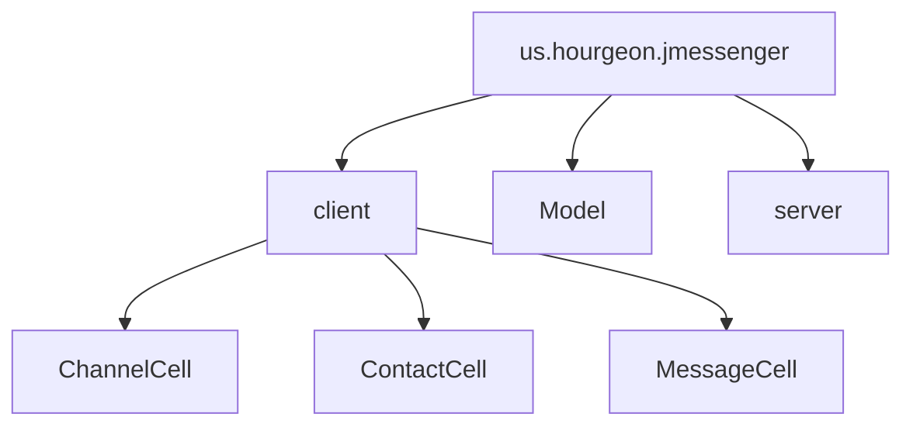

# Rapport de Projet Java

16 Mars 2019 - ISEN AP4

* Rémi Bourgeon
* Rodolphe Houdas

## Introduction

Dans le cadre du cours de Java, nous devons réaliser une messagerie instantanée. À la manière d'un logiciel comme Slack ou Riot, celui-ci doit permettre de gérer des conversations directes ou des salons.

Le cahier des charges définit plusieurs fonctionnalités. Dans la suite de ce rapport, nous essaierons d'expliquer quelles solutions nous avons adopté.

## Architecture

Le logiciel est articulée autour d'une communication entre un serveur et des clients.

Le logiciel a été développé avec la version 8 du JDK.

### Protocole de communication

Les messages sont échangés à travers les WebSocket qui permettent, à travers des sockets TCP, d'assurer l'intégrité des messages ainsi que la phase de connexion (*handshake*).

Tous les messages sont sérialisés à l'aide de GSON. Tous les salons et utilisateurs possèdent un UUID permettant de les identifier de manière unique.

Un salon administrateur est automatiquement mis en place par le serveur à l'UUID `0x0`. Celui ci permet d'envoyer des requêtes au serveur pour la création d'un salon, l'ajout d'un utilisateur à un salon ou encore pour recevoir l'historique d'un salon.

### Structure des packages

Notre projet est divisé en trois packages principaux, dont deux permettant de générer un `.jar` : le `server` et le `client`.

Le troisième package, `Model`, comporte toutes les classes décrivant les modèles de données qui sont susceptibles d'être utilisés par les deux précédent packages.

Le package `client` contient trois packages qui permettent la création et la gestion des `CellFactory` et des `ListCell` pour les `ListView` de l'interface principale (voir plus bas).

## Fonctionnalités

### Gestion des salons

Dans notre projet, tout échange entre utilisateurs se fait à travers un salon. On définit donc 3 types de salons :

* Conversation : aussi appelée messagerie directe, elle comprend un ou plusieurs utilisateurs. La liste des participants est fixée lors de la création de la conversation
* Salon privé : injoignable sauf si un utilisateur a été ajouté à la liste des participants autorisés
* Salon public : un salon joignable par n'importe qui n'ayant pas été banni par l'administrateur

Les salons privés et publics possèdent un ou plusieurs administrateurs qui peuvent virer, bannir ou promouvoir un participant.

Les modèles permettant la gestion des salons sont définis dans les classes :

* `AbstractChannel`
* `AbstractRoom`
* `PrivateRoom`
* `PublicRoom`
* `DirectMessageConversation`

Ainsi que dans l'interface `Channel`.

Lorsqu'un message est envoyé, celui-ci contient l'UUID du salon cible, ce qui permet au serveur de sélectionner les participants au salon cible et de leur envoyer sélectivement le message.

Les utilisateurs peuvent quitter un salon, ce qui les désinscrit de la liste des participants du salon.

### Gestion de droits

Dans un salon privé ou public, les participants peuvent être simple utilisateur ou administrateur.

L'administrateur d'un salon privé possède les droits pour bannir, promouvoir, inviter un participant, ou exporter le contenu de l'historique du salon en XML.

L'administrateur d'un salon public possède uniquement les droits pour promouvoir ou exporter le contenu de l'historique du salon en XML.

### Interface graphique

L'interface graphique a été développée en JavaFX. Au démarrage, la fenêtre affiche l'interface de connexion, qui sera remplacée par la suite par l'interface principale.

#### Interface de connexion

Celle-ci est très sobre et comprend un champ pour entrer un nom d'utilisateur et l'adresse d'un serveur. En l'absence d'un nom d'utilisateur, un nom aléatoire est attribué sous la forme `"User#" + random UUID`. L'adresse du serveur est à donner sous la forme `ws://<server_address>:<port>`. Si celle-ci n'est pas compatible ou si le serveur ne répond pas, un pop-up d'erreur apparaîtra.

Le processus de connexion/déconnexion/reconnexion que nous avons prévu est le suivant :

* L'utilisateur se connecte
* Il se voit attribuer un UUID (il est à la charge de l'utilisateur d'enregistrer et de garder cet UUID dans un lieu sécurisé pour pouvoir se reconnecter)
* L'interface principale est chargée, l'utilisateur est ajouté dans le salon général, les données sont synchronisées
* L'utilisateur se déconnecte
* L'utilisateur se reconnecte avec son UUID
* L'interface principale est chargée, l'utilisateur récupère son profil et les données sont synchronisées

Pour changer de nom d'utilisateur, il suffit de se déconnecter et de se reconnecter avec le même UUID mais avec un nom d'utilisateur différent.

#### Interface principale

L'interface principale se divise en 3 panneaux :

##### Le panneau des salons

Celui-ci contient la liste des salons (privés, publics et conversations) sous la forme de `ListView`s utilisant `CellFactory`. Ce `CellFactory` est réutilisé dans le dialogue de sélection du salon à joindre.

Un seul salon est sélectionnable à la fois. Afin d'avoir une sélection synchronisées entre les listes, nous avons dû développer un `SelectionModel` spécifique.

Lors de la sélection d'un salon dans la liste des salons, une mise à jour de la vue est déclenchée et une requête pour l'historique du salon cible est envoyée au serveur.

Un salon privé est marqué d'un verrou.

Un clic droit sur un salon affiche un menu permettant de quitter le salon sélectionné.

Au-dessus de la liste des salons est présent le nom de l'utilisateur et un bouton pour se déconnecter du serveur. Un clic droit sur le nom d'utilisateur permet de copier l'UUID de l'utilisateur afin qu'il puisse se reconnecter à l'aide de celui-ci.

##### Le panneau des messages

Il comporte lui aussi une `ListView` avec son propre `CellFactory`. Le `CellFactory` est capable d'afficher le nom d'utilisateur courant, de manière dynamique.

Un champ de texte accompagné d'un bouton permettent d'envoyer un message dans le salon courant.

Lorsqu'un message est reçu à destination du salon courant, il est automatiquement ajouté et la `ListView` se déplace jusqu'au dernier message.

Au-dessus de la liste des messages, le nom du salon est affiché, accompagné du bouton d'export vers le XML.

##### Le panneau des participants

Encore une fois, nous avons ici une `ListView` avec un `CellFactory` pour la liste des participants. Ce `CellFactory` est aussi utilisé dans le dialogue d'invitation. Cette liste des participants provient de l'objet `AbstractChannel` représentant le salon courant. Elle est mise à jour lorsqu'on change de salon courant.

Dans la liste des participants, un administrateur est marqué d'une étoile.

Un clic droit sur un participant permet d'accèder aux options d'administration du participant.

Un bouton d'invitation invoquant le dialogue d'invitation apparaît dans les salons privés en dessous de la liste des participants.

#### Dialogues

Plusieurs dialogues permettent d'opérer à la gestion des salons et des participants.

##### Création d'une conversation

Celui-ci affiche une liste des utilisateurs disponibles. Il est possible de sélectionner plusieurs utilisateurs en utilisant `Ctrl` + clic gauche.

L'ouverture de ce dialogue déclenche une requête pour la liste des utilisateurs connectés.

##### Création d'un salon

Celui-ci permet de créer un salon juste en entrant un nom pour le salon. Une case à cocher permet de créer un salon privé plutôt que public.

Lorsqu'un salon est créé, l'ensemble des utilisateurs connectés au serveur reçoit une notification.

##### Joindre un salon

Celui-ci affiche la liste des salons disponibles pour l'utilisateur, c'est-à-dire la liste des salons qu'il est autorisé à joindre mais qu'il n'a pas encore joint.

L'ouverture de ce dialogue déclenche une requête pour la liste des salons disponibles.

Lorsqu'un utilisateur joint un salon, l'ensemble des participants au salon reçoit une notification.

### Export de l'historique en XML

L'export de l'historique d'un salon en XML est disponible pour les utilisateurs qui sont administrateur d'un salon ou pour une conversation. L'appui sur le bouton concerné situé dans le panneau d'affichage des message déclenche la création d'un fichier `export.xml` dans le dossier de travail courant.
